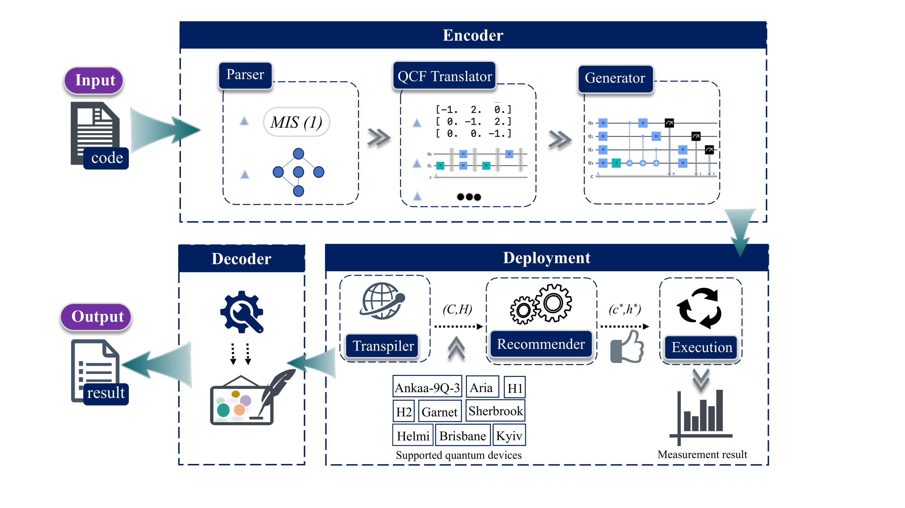

# C2|Q>: Classical-to-Quantum Software Development Framework

[](LICENSE)
[](https://www.python.org/downloads/)
[]()

---

## Overview

**C2|Q>** is a modular quantum software development framework that automates the full pipeline from classical problem specifications to quantum circuit generation and execution.

This repository accompanies the article:

> **"C2|Q>: A Robust Framework for Bridging Classical and Quantum Software Development"**
> Submitted to *ACM Transactions on Software Engineering and Methodology (TOSEM), 2025.*

---

## Table of Contents
- [Features](#features)
- [Architecture](#architecture)
- [Getting Started](#getting-started)
- [Running Tests](#running-tests)
- [Contributing](#contributing)
- [License](#license)
- [Contact](#contact)

## Features
- Submit **standard Python code** describing a problem.
- Automatically **parse**, the problem into **Quantum-Compatible Formats (QCFs)**.
- **Select suitable quantum algorithms** (e.g., QAOA, VQE, Grover).
- **Recommend appropriate quantum devices** across platforms (e.g., IBM, IonQ, Rigetti).
- **Transpile and execute** on hardware or simulators.

---

## Architecture



Refer to [`src/assets/workflow_editted-1.png`](src/assets/classiq_flow.pdf) for detailed component diagrams and workflow explanations.

---

## Getting Started

### Prerequisites
- Python 3.10+
- Git

### Quickstart
```bash
git clone https://github.com/C2-Q/C2Q.git
cd C2Q
pip install -r requirements.txt
```

### Running Tests
Run the unit tests with `pytest` after installing the dependencies:
```bash
PYTHONPATH=. pytest -q
```
---
## Using JSON DSL Input

In addition to Python code snippets, **C2|Q>** supports a lightweight **JSON-based Domain-Specific Language (DSL)** that allows developers to describe quantum problem instances without writing any quantum code.

### 📄 Example Format

Each JSON file must contain two fields:

- `"problem_type"`: the problem class (e.g., `"maxcut"`, `"add"`, `"factor"`)
- `"data"`: problem-specific parameters

Example — MaxCut on a 4-node graph:

```json
{
  "problem_type": "maxcut",
  "data": {
    "nodes": 4,
    "edges": [[0, 1], [1, 2], [2, 3], [3, 0], [0, 2]]
  }
}
```

Supported problem types:
- `maxcut`
- `mis` (Maximum Independent Set)
- `tsp`
- `clique`
- `kcolor`
- `vc` (Minimum Vertex Cover)
- `factor` (Integer Factorization)
- `add` (Integer Addition)
- `mul` (Integer Multiplication)
- `sub` (Integer Subtraction)

Sample files are available in: `src/tests/json_examples/`

---

### 🚀 Running JSON Inputs via CLI

To execute a JSON-defined problem instance using the full C2|Q> workflow, run:

```bash
python -m src.json_engine --input src/tests/json_examples_1/MIS_05.json
```

This command:
- Parses and validates the input
- Classifies the problem and extracts relevant data
- Generates a quantum circuit using the correct algorithm
- Selects the best-fit backend (simulator or hardware)
- Transpiles, executes, and generates reports

---

### 📁 Output

A detailed PDF report will be saved in:

```
./MIS_report.pdf
```

Each report includes:
- Problem summary and visualization
- Quantum circuit diagram
- Device recommendation and parameters
- Execution results (e.g., bitstring outcomes, optimal solution)
- Runtime, fidelity, and cost breakdown

---

## Contributing
We welcome contributions from researchers, developers, and practitioners interested in quantum software engineering.

### Development Workflow
1. **Fork** the repository on GitHub.
2. **Clone** your fork and install dependencies:
   ```bash
   git clone https://github.com/YOUR_USERNAME/C2Q.git
   cd C2Q
   python -m venv venv
   source venv/bin/activate  # On Windows use venv\Scripts\activate
   pip install -r requirements.txt
   ```
3. **Create** a feature branch:
   ```bash
   git checkout -b feature/my-feature
   ```
4. **Commit** your changes:
   ```bash
   git add .
   git commit -m "Add explanation / fix bug / implement feature"
   ```
5. **Push** and open a pull request:
   ```bash
   git push origin feature/my-feature
   ```

### Guidelines
- Follow PEP8 coding conventions.
- Document public functions and modules clearly.
- Keep commits focused and descriptive.
- Be respectful in discussions and code reviews.

---

## License
This project is licensed under the [Apache 2.0 License](LICENSE).

## Contact
For research collaboration or substantial contributions, contact the maintainer:

📧 boshuai.ye@oulu.fi

📧 Teemu.Pihkakoski@oulu.fi

📧 arif.khan@oulu.fi (Project Principal Investigator (PI))
