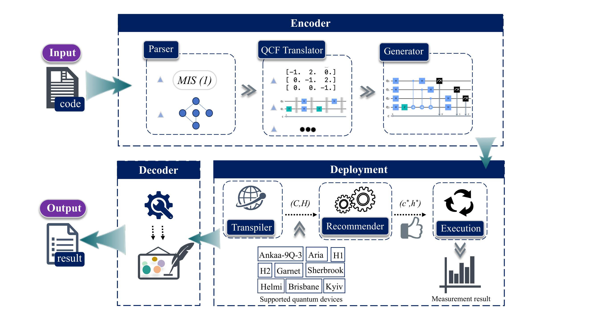

# C2|Q>: Classical-to-Quantum Software Development Framework

[](LICENSE)
[](https://www.python.org/downloads/)
[]()

## Overview

**C2|Q>** is a modular framework for moving from classical problem specifications to quantum-ready problem representations, circuit generation, execution, and report generation.

This repository accompanies the article:

> **"C2|Q>: A Robust Framework for Bridging Classical and Quantum Software Development"**  
> Published in *ACM Transactions on Software Engineering and Methodology (TOSEM)*.  
> DOI: [10.1145/3803018](https://dl.acm.org/doi/10.1145/3803018)  
> Preprint: [arXiv:2510.02854](https://arxiv.org/abs/2510.02854)

If you use this project, cite the published TOSEM paper:

```bibtex
@article{10.1145/3803018,
  author = {Ye, Boshuai and Khan, Arif Ali and Pihkakoski, Teemu and Liang, Peng and Azeem Akbar, Muhammad and Silveri, Matti and Malmi, Lauri},
  title = {C2|Q>: A Robust Framework for Bridging Classical and Quantum Software Development},
  year = {2026},
  publisher = {Association for Computing Machinery},
  address = {New York, NY, USA},
  issn = {1049-331X},
  url = {https://doi.org/10.1145/3803018},
  doi = {10.1145/3803018},
  journal = {ACM Trans. Softw. Eng. Methodol.},
  month = mar,
  keywords = {Quantum Computing, Quantum Software Development, Quantum Programming, Quantum Software Engineering}
}
```

Artifact-review companion documents:
- [INSTALL](INSTALL.md)
- [REQUIREMENTS](REQUIREMENTS.md)
- [STATUS](STATUS.md)
- [Claims Map](docs/CLAIMS_MAP.md)
- [RCR Draft](docs/RCR_DRAFT.md)

Optional community mirrors (not the primary artifact reproduction path):
- [Hugging Face paper page](https://huggingface.co/papers/10.1145/3803018)
- [Hugging Face model repo](https://huggingface.co/boshuai1/c2q-parser-codebert)
- [Hugging Face dataset repo](https://huggingface.co/datasets/boshuai1/c2q-dataset)

## What To Run

Use these commands as the main entry points for the paper-backed artifact paths:

| Purpose | Command                                                                | Model required | Main output |
|---|------------------------------------------------------------------------|---|---|
| Optional Docker image build | `make docker-build`                                                    | No | Docker image `c2q:latest` |
| Experiment 1: encoder evaluation assets | notebook/manual assets in `src/parser/parser_train_results_12_1.ipynb` | No | `src/parser/parser_train_results_12_1.ipynb` |
| Experiment 2: deployment evaluation | `make recommender-maxcut`                                              | No | `artifacts/recommender_maxcut/` |
| Experiment 3: Python-code smoke reproduction | `make reproduce-smoke`                                                 | Yes | `artifacts/reproduce/smoke/` |
| Experiment 3: Python-code full reproduction | `make reproduce-paper`                                                 | Yes | `artifacts/reproduce/paper/` |
| Experiment 3: JSON smoke reproduction | `make reproduce-json-smoke`                                            | No | `artifacts/reproduce/json/smoke/` |
| Experiment 3: JSON full reproduction | `make reproduce-json-paper`                                            | No | `artifacts/reproduce/json/paper/` |
| Supporting validation only | `make validate-dataset`                                                | Yes | `artifacts/parser_validation/` |

All generated outputs from the `make`-based experiment paths are written under `artifacts/`.

## Repository Layout

- `src/` – framework source code
- `src/parser/` – parser code, training notebook, checkpoints, model helpers
- `src/c2q-dataset/` – JSON inputs and dataset assets
- `tools/` – reproducibility and environment helpers
- `scripts/` – experiment orchestration scripts
- `artifacts/` – generated outputs from reproducibility commands

## Reviewer Start Options

Choose one of these two entry paths:

- Lowest setup burden: Docker. This avoids installing Python 3.12 locally.
- Fastest local iteration: source checkout with Python 3.12.

For the TOSEM RCR report, the recommended primary reproduction path is the source checkout path in Option B.
Use the Docker path in Option A as the lowest-barrier sanity check.
Hugging Face mirrors are optional community access points and are not part of the primary reviewer workflow.

## Option A: Docker (Lowest Setup Burden)

Use Docker if you do not want to install Python 3.12 on the host machine.

```bash
git clone https://github.com/C2-Q/C2Q.git
cd C2Q
make docker-build
```

Minimal Docker verification:

```bash
make docker-reproduce-json-smoke
```

Notes:
- Docker commands use `/tmp/c2q-venv` inside the container
- host `.venv` is untouched
- outputs are still written under `artifacts/`
- `make docker-reproduce-json-smoke` does not require the parser model
- after installing the parser model, the next Docker check is `make docker-smoke`

## Option B: Source Checkout (Fastest Local Path)

Use this path if Python 3.12 is already available locally.

Primary shell path: `bash` or `zsh` on macOS / Linux.

Check it first:

```bash
python3.12 --version
```

If `python3.12` is missing:
- macOS:
  - `brew install python@3.12`
  - or install Python 3.12 from [python.org downloads](https://www.python.org/downloads/)
- Linux:
  - install Python 3.12 using your distribution packages
  - then check with `python3.12 --version`
  - if Python 3.12 is not easily available, use the Docker path instead

```bash
git clone https://github.com/C2-Q/C2Q.git
cd C2Q
python3.12 -m venv .venv
source .venv/bin/activate
python -m pip install --upgrade pip
python -m pip install -e ".[dev]"
```

Windows PowerShell is supported as a secondary path.
Equivalent commands:

```powershell
py -3.12 --version
git clone https://github.com/C2-Q/C2Q.git
cd C2Q
py -3.12 -m venv .venv
.\.venv\Scripts\Activate.ps1
python -m pip install --upgrade pip
python -m pip install -e ".[dev]"
```

If Python 3.12 is missing on Windows, install it from [python.org downloads](https://www.python.org/downloads/), then re-run `py -3.12 --version`.

If PowerShell blocks activation, run:

```powershell
Set-ExecutionPolicy -Scope Process Bypass
.\.venv\Scripts\Activate.ps1
```

If you only need the model-free JSON report path, you can stop here and run:

```bash
make reproduce-json-smoke
make reproduce-json-paper
```

If you want to continue to the model-backed Python-code path, install the parser model first in the next section, then run:

```bash
make doctor
```

`make doctor` checks Python, LaTeX, and parser-model availability for the model-backed route.

This source-checkout path is the recommended path for the main TOSEM RCR reproduction steps.

## Parser Model Setup

The parser model is not bundled in the Git repository or in PyPI because of file size.

Preferred scripted model archive:
- [saved_models_2025_12.zip (GitHub Release)](https://github.com/C2-Q/C2Q/releases/download/v1.0-artifact/saved_models_2025_12.zip)

Archival model record:
- [saved_models_2025_12.zip (Zenodo)](https://zenodo.org/records/19061126/files/saved_models_2025_12.zip?download=1)

Recommended reviewer setup:

```bash
make model-setup MODEL_ARCHIVE=/path/to/saved_models_2025_12.zip
```

What `make model-setup` does:
- installs into the default path: `src/parser/saved_models_2025_12`
- first looks for a local archive in common locations such as `~/Downloads/saved_models_2025_12.zip`
- if you already have the archive somewhere else, pass it explicitly:

```bash
make model-setup MODEL_ARCHIVE=/path/to/saved_models_2025_12.zip
```

- if no local archive is found, it tries the configured release URL as a best-effort fallback

Reviewer note:
- the GitHub Release asset above works with scripted download and is the preferred automation target
- the Zenodo record remains the archival copy
- if scripted download is blocked in a given environment, browser download plus `make model-setup MODEL_ARCHIVE=...` is still the fallback reviewer path

Recommended installation path:
1. Run:

```bash
make model-setup
```

2. If you want to install from a browser-downloaded zip instead, download either archive above and then run:

```bash
make model-setup MODEL_ARCHIVE=/path/to/saved_models_2025_12.zip
```

3. Verify it:

```bash
make model-check
```

Equivalent manual helper:

```bash
python tools/setup_model.py --archive /path/to/saved_models_2025_12.zip --model-path src/parser/saved_models_2025_12
```

Most robust manual installation path:
1. Download the archive in a browser from the GitHub Release asset above.
2. Install it with:

```bash
make model-setup MODEL_ARCHIVE=/path/to/saved_models_2025_12.zip
```

Optional helper:

```bash
make model-setup
make model-download
```

Use `make model-download` only as a convenience path. `make model-setup` is now the preferred command because the default source points to the GitHub Release asset. Browser download plus `MODEL_ARCHIVE=...` remains the most robust route across environments.

Required files inside the model directory:
- `config.json`
- `tokenizer_config.json`
- one weight file: `model.safetensors` or `pytorch_model.bin`

Commands that require the parser model:
- `make smoke`
- `make reproduce-smoke`
- `make reproduce-paper`
- `make validate-dataset`
- `make verify-model`
- `make docker-smoke`

Commands that do not require the parser model:
- `make reproduce-json-smoke`
- `make reproduce-json-paper`
- `make recommender-maxcut`
- `make docker-reproduce-json-smoke`
- `make docker-recommender-maxcut`

Additional Docker commands:

```bash
make docker-reproduce-json-smoke
make docker-reproduce-json-paper
make docker-recommender-maxcut
make docker-validate-dataset
make docker-paper
```

## Experiments Used In The Paper

### Experiment 1: Encoder Evaluation

In the paper, Experiment 1 evaluates the input-analysis / encoder module on 434 synthetic Python code snippets. The reported headline results are a weighted-average F1 score of 98.2% for problem classification and a 93.8% completion rate for data extraction.

Main assets:
- notebook with training and recorded evaluation outputs: `src/parser/parser_train_results_12_1.ipynb`
- intermediate checkpoints: `src/parser/results/`
- released trained model archive: [GitHub Release zip](https://github.com/C2-Q/C2Q/releases/download/v1.0-artifact/saved_models_2025_12.zip)

This experiment is primarily supported through archived notebook/results provenance rather than a first-line `make` target. The minimal reviewer path uses the released model rather than retraining.

### Experiment 2: Deployment Evaluation

Run:

```bash
make recommender-maxcut
```

This path does **not** require the parser model.

Outputs:
- raw recommender CSVs and plots: `artifacts/recommender_maxcut/raw_csv/`
- post-processed Algorithm 1 outputs: `artifacts/recommender_maxcut/algorithm1/`

Key files:
- `artifacts/recommender_maxcut/raw_csv/errors_wide.csv`
- `artifacts/recommender_maxcut/raw_csv/times_wide.csv`
- `artifacts/recommender_maxcut/raw_csv/prices_wide.csv`
- `artifacts/recommender_maxcut/raw_csv/recommender_output_errors.pdf`
- `artifacts/recommender_maxcut/raw_csv/recommender_output_prices.pdf`
- `artifacts/recommender_maxcut/raw_csv/recommender_output_times.pdf`
- `artifacts/recommender_maxcut/algorithm1/winners.csv`
- `artifacts/recommender_maxcut/algorithm1/details.csv`

This corresponds to the paper’s deployment / hardware recommender evaluation on workloads scaling up to 56 qubits.

### Experiment 3: Full Workflow Validation (Python and JSON Paths)

Python-code report path:

```bash
make reproduce-smoke
make reproduce-paper
```

This path requires the parser model.

Outputs:
- smoke path: `artifacts/reproduce/smoke/`
- paper path: `artifacts/reproduce/paper/`

JSON example report path:

```bash
make reproduce-json-smoke
make reproduce-json-paper
```

This path does **not** require the parser model.

Outputs:
- smoke path: `artifacts/reproduce/json/smoke/`
- paper path: `artifacts/reproduce/json/paper/`

The curated JSON smoke subset currently includes one example each for `ADD`, `Factor`, `MaxCut`, and `MIS`.

The full Python paper run is time-consuming and takes roughly **10 hours**.
The full JSON paper run is slower than the smoke path, takes roughly **2 hours**, and is intentionally not run by default here.

This path corresponds to the paper’s end-to-end validation on 434 Python programs and 100 JSON problem instances.
The associated paper data record is [C2|Q> Dataset: Reports and Evaluation Inputs (v1.0.0)](https://doi.org/10.5281/zenodo.17071667).

The paper also reports a proxy-based usability analysis. Those supporting materials are part of the archived evaluation record rather than a primary `make` target in this repository.

### Supporting Validation (Not a Numbered Paper Experiment)

Run:

```bash
make validate-dataset
```

This path requires the parser model.

Outputs:
- implementation-level validation: `artifacts/parser_validation/implementation/`
- algorithmic/structural validation: `artifacts/parser_validation/diversity/`

Key files:
- `artifacts/parser_validation/implementation/snippet_metrics.csv`
- `artifacts/parser_validation/implementation/family_summary.csv`
- `artifacts/parser_validation/implementation/syntax_failures.csv`
- `artifacts/parser_validation/diversity/summary_by_tag.csv`
- `artifacts/parser_validation/diversity/algorithm_diversity_summary.csv`
- `artifacts/parser_validation/diversity/algorithm_signals_per_instance.csv`

## Tests

Fast default tests:

```bash
PYTHONPATH=. pytest
```

Model-backed tests:

```bash
make verify-model
```

## PyPI Installation

For lightweight CLI/API use without cloning the repo:

```bash
python -m pip install --upgrade pip
python -m pip install --upgrade c2q-framework
```

PyPI installs are supported on **Python 3.12** for this release.

Optional extras:

```bash
python -m pip install --upgrade "c2q-framework[parser]"
python -m pip install --upgrade "c2q-framework[recommender]"
python -m pip install --upgrade "c2q-framework[artifact]"
python -m pip install --upgrade "c2q-framework[cloud]"
```

Use them as follows:
- `parser`: installs the parser-related Python dependencies only; the parser model archive is still downloaded and installed separately
- `recommender`: CSV export and experiment helpers
- `artifact`: installs the heavier parser + recommender Python dependencies used by the repository artifact path; it is most useful together with a source checkout, not as a pure PyPI-only workflow
- `cloud`: optional live-provider SDK integrations

The `parser` extra does **not** download or install the trained model automatically. For parser-backed use, install the model archive separately with `make model-setup` from a source checkout, or extract the released model archive into your chosen `model_path` and pass that path to the `Parser` API.

If you are using the PyPI path without cloning the repository:
- download the parser model archive from [GitHub Release](https://github.com/C2-Q/C2Q/releases/download/v1.0-artifact/saved_models_2025_12.zip) or the [Zenodo archival copy](https://zenodo.org/records/19061126/files/saved_models_2025_12.zip?download=1)
- extract it manually into a directory of your choice
- pass that directory to the parser API as `model_path`

PyPI is intended for lightweight CLI/API use. The paper-backed `make reproduce-*`, `make validate-dataset`, and Docker reviewer paths belong to the source repository workflow, not the pure PyPI workflow.

Check the installed version:

```bash
python -m pip show c2q-framework
```

CLI help:

```bash
c2q-json -h
```

Minimal model-free PyPI run:

```bash
cat > mis_01.json <<'EOF'
{
  "family": "MIS",
  "goal": "find a maximum independent set of the graph",
  "description": "Minimal MIS example",
  "instance": {
    "graph_rep": "edge_list",
    "graphs": {
      "G1": [[0, 1], [1, 2], [2, 3]]
    }
  }
}
EOF

c2q-json --input mis_01.json
```

Expected result:
- generates a PDF report in the current working directory
- does not require the parser model

If you are on Windows PowerShell, create `mis_01.json` with the same content in any text editor, then run:

```powershell
c2q-json --input mis_01.json
```

## Programming Interface

Current import namespace is `src.*`.

JSON DSL from Python, without any repository-local files:

```python
from src.json_engine import normalise_task

task = {
    "family": "MIS",
    "goal": "find a maximum independent set of the graph",
    "instance": {
        "graph_rep": "edge_list",
        "graphs": {"G1": [[0, 1], [1, 2], [2, 3]]},
    },
}
family, instance, params, goal = normalise_task(task)
print(family, instance)
```

Parser usage:

```python
from src.parser.parser import Parser

parser = Parser(model_path="/path/to/saved_models_2025_12")
family, data = parser.parse("def add(a,b):\n    return a+b\n")
print(family, type(data).__name__)
```

The parser API requires the `parser` extra in PyPI installs.

Generate a report via Python API:

```python
from src.graph import Graph
from src.problems.maximal_independent_set import MIS

edges = [[0, 1], [1, 2], [2, 3], [0, 3], [0, 2]]
problem = MIS(Graph(edges).G)
problem.report_latex(output_path="API_demo_report")
```

## JSON DSL CLI Example

Repository example:

```bash
c2q-json --input src/c2q-dataset/inputs/json_dsl/mis/mis_01.json
```

This command parses the JSON problem, generates the quantum workflow, and writes a PDF report.

Regenerate the maintained JSON DSL example set under `src/c2q-dataset/inputs/json_dsl/`:

```bash
make json-dsl-examples
```

Generate PDF reports for a curated smoke subset of those JSON DSL examples:

```bash
make reproduce-json-smoke
```

The curated smoke subset currently includes one example each for `ADD`, `Factor`, `MaxCut`, and `MIS`.

If you want the lowest-setup reviewer check, use:

```bash
make docker-reproduce-json-smoke
```

This path does not require a local Python installation or the parser model.

Generate PDF reports for the full JSON DSL example set:

```bash
make reproduce-json-paper
```

Outputs are written to:
- smoke: `artifacts/reproduce/json/smoke/`
- paper: `artifacts/reproduce/json/paper/`

The full JSON reproduction path is intentionally not run by default here because it is slow and takes roughly 2 hours.

## Architecture



Detailed component diagrams are available in `src/assets/classiq_flow.pdf`.

## Contact

For research collaboration or substantial contributions:

- boshuai.ye@oulu.fi
- Teemu.Pihkakoski@oulu.fi
- arif.khan@oulu.fi (Project Principal Investigator, PI)
- matti.silveri@oulu.fi (Project Principal Investigator, PI)
- liangp@whu.edu.cn (Outside Collaborator, Peng Liang)

## License

This project is licensed under the [Apache 2.0 License](LICENSE).
